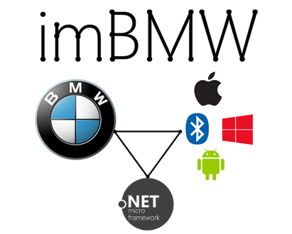
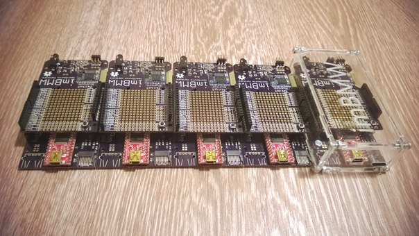
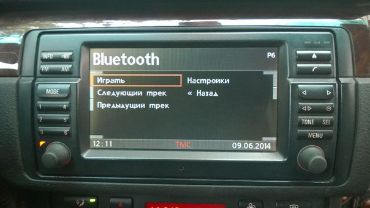
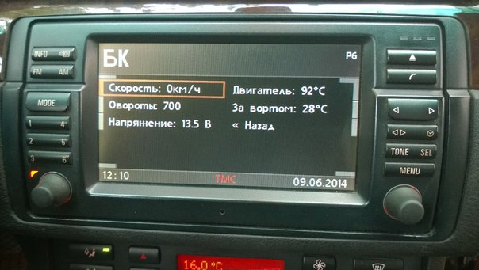
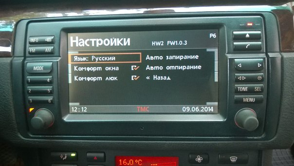

imBMW · BMW iBus integration SDK and hardware
=========================

[imBMW]: http://imBMW.net "imBMW"
[toxs]: http://toxs.ru "toxs"
[iBus]: http://web.archive.org/web/20041204074622/www.openbmw.org/bus/ "iBus"

[imBMW] is .NET Micro Framework and hardware project. 
It was started to add custom features to cars with [iBus] interface 
such as '91-'10 BMWs and some models of Mini, Land Rover, Rover, MG and Rolls Royce. 

The imBMW V1 device, that uses FEZ Mini, connects iPod via headset cable to BMW audio system.

The imBMW V2 device, that uses FEZ Cerb40 II, is a *duino iBus-ready board. It could be used with any shield, for example with imBMW Bluetooth OVC3860 Shield for wireless stereo audio connection to BMW audio system.

CD-changer emulator and Bordmonitor AUX interface were implemented to connect radio with iPod/iPhone/iPad or with other players, phones and tablets like Windows Phone, Android etc. 
Also imBMW allows to communicate with instrument cluster, immobilizer, GM, ZKE, navigation and other modules to receive notifications and control doors, windows, lights, etc.

You could [order imBMW boards](http://oshpark.com/profiles/toxsedyshev) from OSH Park.  
Also you could order assembled imBMW V2 + Bluetooth, details by email: [imbmw@toxs.ru](mailto:imbmw@toxs.ru).  
Visit [imBMW YouTube playlist](http://www.youtube.com/playlist?list=PLDuwqawzvazj9iFQQ9aeggeXeUPphfv94) on my channel.  
Stay in touch with [imBMW in vk.com](http://vk.com/imbmw) social network.  
Photos, videos and creation process of imBMW V1 and V2 devices are located on [e46club.ru forum](http://bmwfanatics.ru/forumvb/viewtopic.php?f=32&t=92399) (for now, only in Russian).

Some screens for example. Playing Bluetooth music, custom bordcomputer, additional features, russian UI:  
  
  

imBMW compatability
------------------

iBus-compatible cars are listed below:
* BMW 3-series E46, E36*
* BMW 5-series E39, E34*, E60*
* BMW 7-series E38
* BMW 8-series E31*
* BMW X3 E83
* BMW X5 E53
* BMW Z4 E85, E86
* BMW Z8 E52
* MINI Cooper R50, Cooper S R53
* Land Rover Range Rover L30
* Rover 75 R40
* Saab 9-3 2003+

Notes:
* E31 uses different device IDs.
* Last 2 production years of E36 and E34 had iBus-controlled CD43 radio and CD-changers.
* E60 ver. USA had iBus-controlled seat occupation sensor.

imBMW license
------------------

[imBMW] is developed by [toxs] and distributed under Open Source
[CC Attribution Non-Commercial Share Alike License](http://creativecommons.org/licenses/by-nc-sa/3.0/). 
This basically means:
* Licensees may copy, distribute, display and perform the work and make derivative works 
based on it only if they give the author or licensor the credits in the manner specified by these.
* Licensees may copy, distribute, display, and perform the work and make derivative works 
based on it only for noncommercial purposes.
* Licensees may distribute derivative works only under a license identical to the license 
that governs the original work.

© Copyright 2013-2014 [toxs] · All Rights Reserved